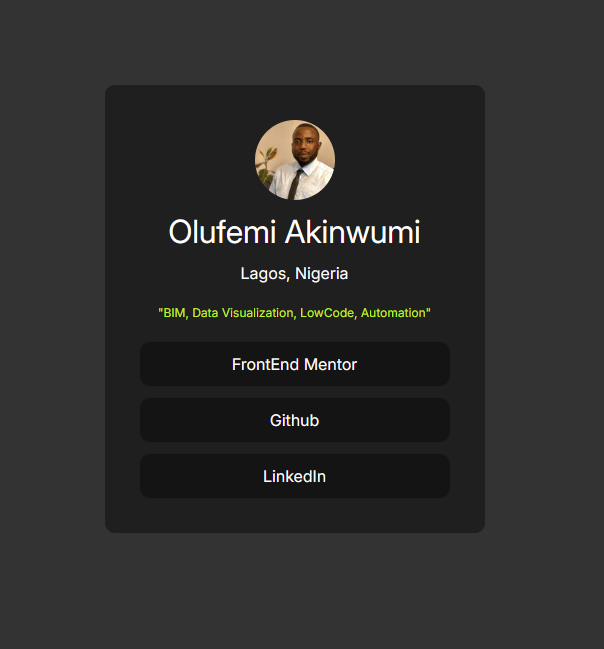

<!-- @format -->

# Frontend Mentor - Social links profile solution

This is my solution to the [Social links profile challenge on Frontend Mentor](https://www.frontendmentor.io/challenges/social-links-profile-UG32l9m6dQ).

## Overview

### The challenge

Users should be able to:

- See hover and focus states for all interactive elements on the page

### Screenshot

### Links

- Solution URL: [https://www.frontendmentor.io/profile/01U2](https://www.frontendmentor.io/profile/01U2)
- Live Site URL: [Add live site URL here](https://your-live-site-url.com)

## My process

### Built with

- Semantic HTML5 markup
- CSS custom properties
- Flexbox
- Mobile-first workflow
- Google Fonts (Inter)

### What I built

- A centered profile card layout using Flexbox on the `body`
- A dark themed container with rounded corners and spacing
- Circular profile image with `border-radius: 50%` and `object-fit: cover`
- Social link buttons styled as full-width blocks inside the card
- Custom text styling for location/highlight text
- Add hover state for all buttons

### What I learned

- How `min-height: 100vh` helps vertical centering on a page
- How `display: flex`, `align-items`, and `justify-content` work together
- The difference between spacing with `padding`, `margin`, and `gap`
- How to style links as buttons and remove default link appearance

### Continued development

- Improve button interaction styles for accessibility

### Useful resources

- [MDN: Flexbox](https://developer.mozilla.org/en-US/docs/Web/CSS/CSS_flexible_box_layout)
- [CSS-Tricks: A Complete Guide to Flexbox](https://css-tricks.com/snippets/css/a-guide-to-flexbox/)

### AI Collaboration

I used AI support for:

- Debugging CSS spacing/alignment issues
- Understanding why some default link styles were still showing
- Getting step-by-step guidance instead of full copy-paste solutions

## Author

- Frontend Mentor - [@01U2](https://www.frontendmentor.io/profile/01U2)
- GitHub - [@01U2](https://github.com/01U2)

## Acknowledgments

Thanks to the Frontend Mentor community and learning resources for beginner-friendly guidance.
@Gomycode
